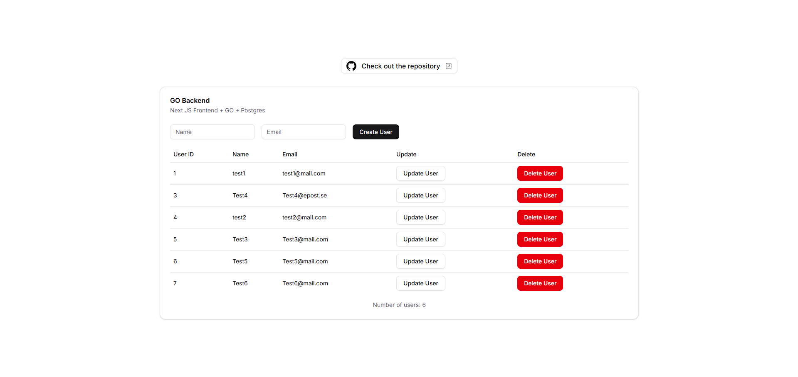

# 🐳 Docker GO + Next.js + PostgreSQL CRUD Project


This project is a simple full-stack user management application built with:

- Next.js _(Frontend)_

- Go _(Backend API with Gorilla Mux)_

- PostgreSQL _(Database)_

- ShadCN _(Components)_

- Docker for containerization

It demonstrates a minimal CRUD (Create, Read, Update, Delete) application where you can manage users with name and email data via a UI. The backend is built using Go, and the frontend uses React through Next.js.

# 📸 Preview



# 📦 Tech Stack

- Frontend: Next.js, React, Tailwind, Axios

- Backend: Go (Gorilla Mux, database/sql, lib/pq)

- Database: PostgreSQL 13

- Containerization: Docker + Docker Compose

# 🚀 Getting Started

✅ Prerequisites
Make sure you have the following installed:

- [Docker](https://www.docker.com/products/docker-desktop)

- [Node.js](https://nodejs.org/en)

# 🛠️ Setup Instructions

1. Clone the repository

```bash
git clone https://github.com/Skill-issue-coding/Docker-GO-NextJS-Test.git

```

2. Move into to the repository

```bash
cd Docker-GO-NextJS-Test
```

3. Build and start all services

```bash
docker compose build
docker compose up -d nextapp
```

This will:

- Build and run the Go backend on `http://localhost:8000`
- Build and run the Next.js frontend on `http://localhost:3000`
- Start a PostgreSQL database on port `5432`

# 🧩 Project Structure

```python
.
├── backend/                    # Go REST API
│ ├── main.go                   # Main API and router logic
│ └── go.dockerfile             # Go service Dockerfile
├── frontend/                   # Next.js frontend
│ ├── app/                      # Main page and logic
│ ├── components/               # UI components (cards, dialogs, tables)
│ └── next.dockerfile           # Next.js service Dockerfile
├── docker-compose.yaml
└── README.md
```

# 🔧 API Endpoints

The backend exposes a REST API under /api/go/users:

| Method | Endpoint             | Description          |
| ------ | -------------------- | -------------------- |
| GET    | `/api/go/users`      | List all users       |
| GET    | `/api/go/users/{id}` | Get user by ID       |
| POST   | `/api/go/users`      | Create new user      |
| PUT    | `/api/go/users/{id}` | Update existing user |
| DELETE | `/api/go/users/{id}` | Delete user          |

# 🌐 Environment Variables

These are defined in the docker-compose.yml file:

## Frontend

```env
NEXT_PUBLIC_SITE_URL=http://localhost:8000
NEXT_PUBLIC_API_URL=http://localhost:8000/api/go/users
```

## Backend

```env
DATABASE_URL=postgres://postgres:postgres@db:5432/postgres?sslmode=disable
```

# 💾 Database

The database is automatically started in Docker with the following default values:

- User: `postgres`

- Password: `postgres`

- Database: `postgres`

The database is initialized with a `users` table:

```sql
CREATE TABLE IF NOT EXISTS users (
  id SERIAL PRIMARY KEY,
  name TEXT,
  email TEXT
);
```

# 🧹 Cleanup

To stop and remove containers:

```bash
docker compose down
```

To remove volumes (including the database):

```bash
docker compose down -v
```

# 👤 Author

Created by [@Skill-issue-coding](https://github.com/Skill-issue-coding)
